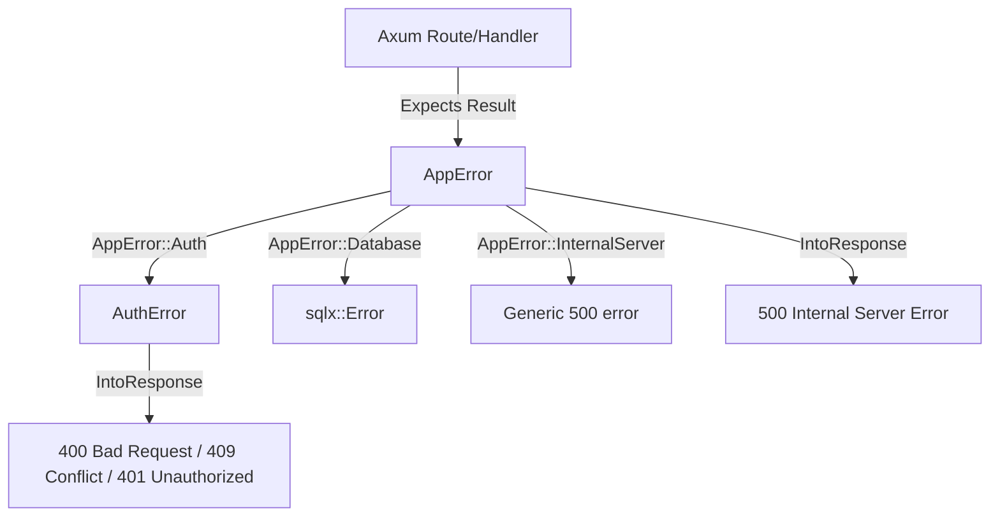

# Error Handling System

This directory houses the error handling structure for the Axum backend. The project uses a hierarchical, domain-driven design powered by the `thiserror` crate to convert application errors into structured HTTP responses.

---

## Architecture Overview



---

## Error Layer Breakdown

### 1. Global Application Error: `AppError` (`src/errors/mod.rs`)

`AppError` is the top-level error enum returned by Axum route handlers. It acts as an umbrella that captures and categorizes lower-layer errors.

```rust
pub enum AppError {
    #[error(transparent)]
    Auth(#[from] AuthError),           // Delegated authentication errors

    #[error("Database error: {0}")]
    Database(#[from] sqlx::Error),     // Automatically catches database issues

    #[error("Internal server error")]
    InternalServer,                    // Catch-all system errors
}
```

- **Safety & Security**: Database errors (`sqlx::Error`) are captured using `#[from]`. The `IntoResponse` implementation logs the detailed database error internally on the server but returns a sanitized `500 Internal Server Error` with `{"error": "Internal database error"}` to the client to prevent SQL injection or schema leaks.
- **Axum Integration**: Implements `IntoResponse` to translate Rust errors directly into HTTP responses.

---

### 2. Domain Error: `AuthError` (`src/errors/auth_error.rs`)

`AuthError` handles all authentication and authorization specific failures.

```rust
pub enum AuthError {
    Conflict(String),      // 409 Conflict (e.g., "User already exists")
    Validation(String),    // 400 Bad Request (e.g., input validation failure)
    Unauthorized,          // 401 Unauthorized (e.g., invalid password, expired token)
    InternalServer,        // 500 Internal Server Error (e.g., hashing failures)
}
```

- **Convenience conversion**: Since `AppError` implements `#[from] AuthError`, returning a local `AuthError` inside handlers will automatically cast to `AppError` using the `?` operator.

---

## Response Formatting Example

When a client makes a request that fails validation or triggers a database conflict, the system returns a unified JSON format:

```json
{
  "error": "Error message description"
}
```

### Mapping Matrix

| Error Variant | HTTP Status Code | Client Payload |
|---|---|---|
| `AuthError::Conflict(msg)` | `409 Conflict` | `{"error": "<msg>"}` |
| `AuthError::Validation(msg)` | `400 Bad Request` | `{"error": "<msg>"}` |
| `AuthError::Unauthorized` | `401 Unauthorized` | `{"error": "Unauthorized"}` |
| `AppError::Database` | `500 Internal Server Error` | `{"error": "Internal database error"}` |
| `AppError::InternalServer` | `500 Internal Server Error` | `{"error": "Internal server error"}` |
